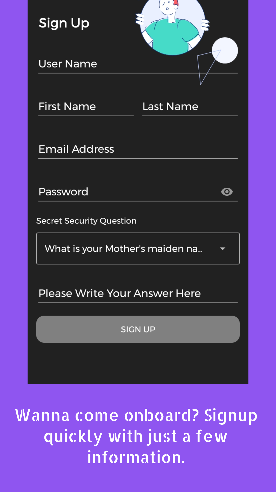
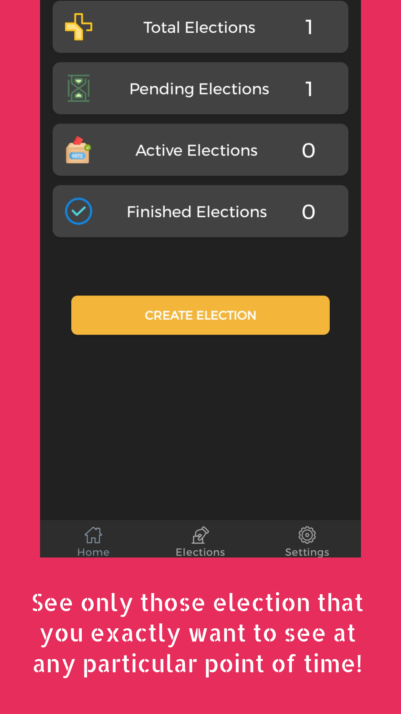
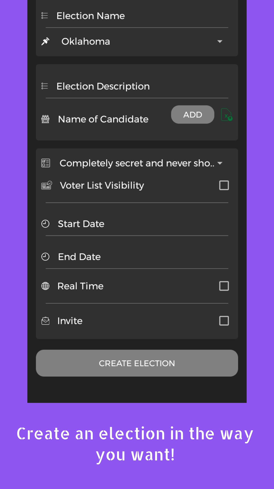
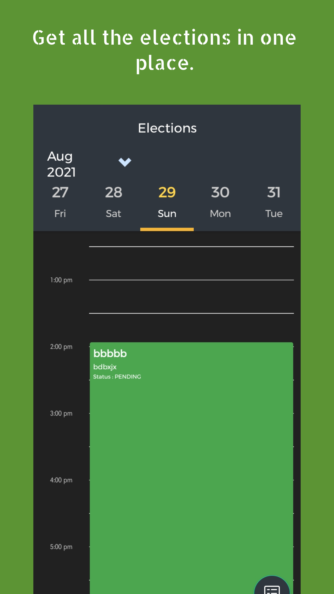
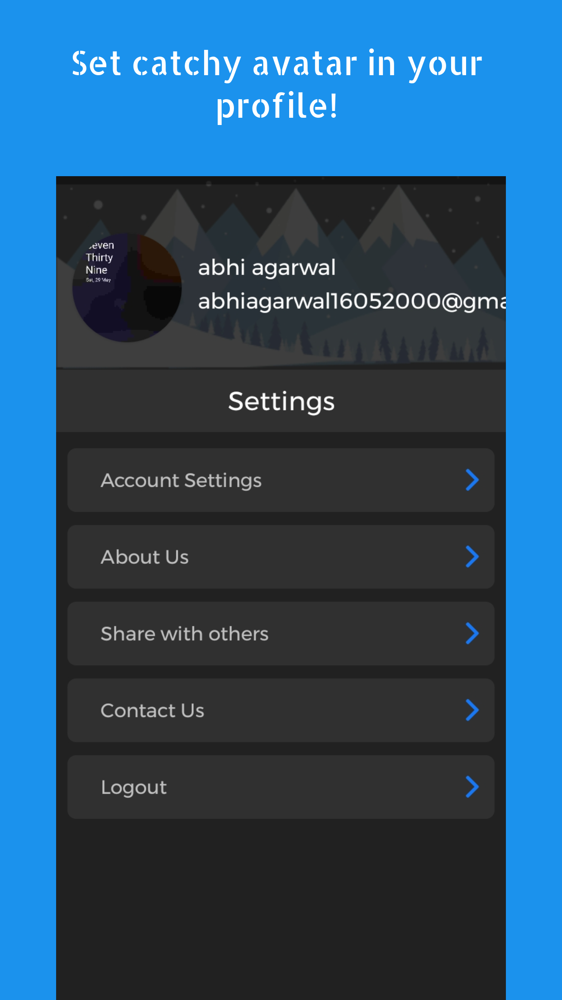
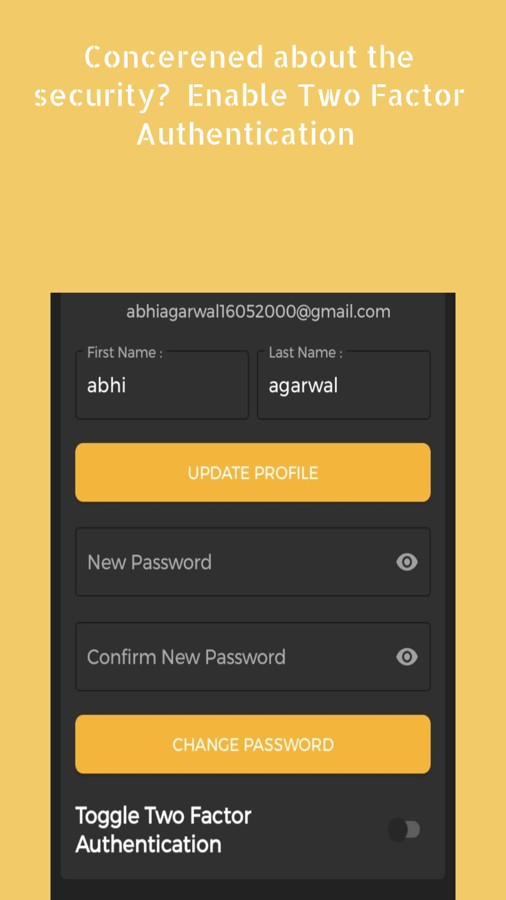
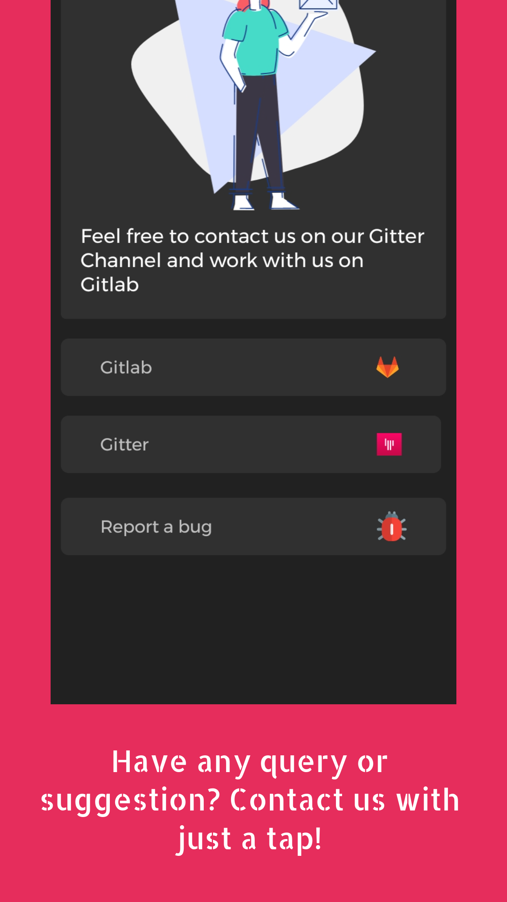
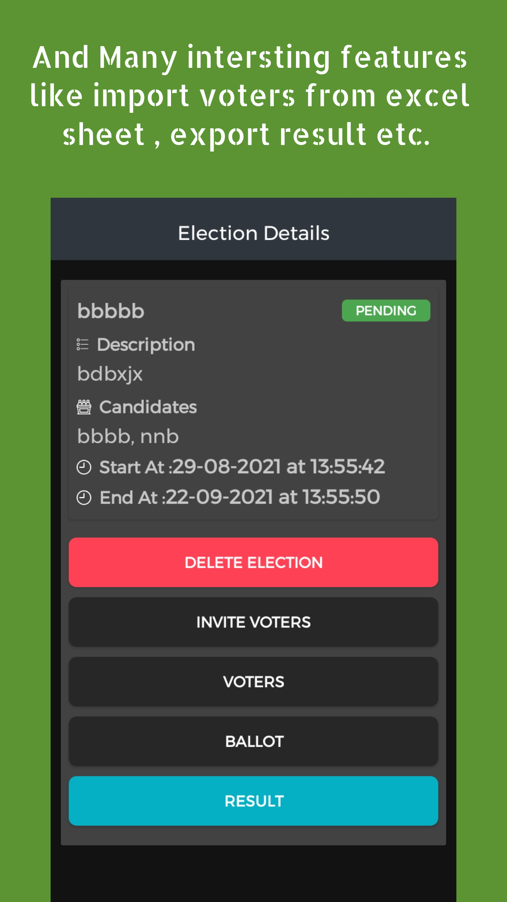

# Agora Android Application

_Android Application for Agora Web that uses [Agora](https://gitlab.com/aossie/Agora/): An Electronic Voting Library implemented in Scala. This application uses [Agora Web API](https://gitlab.com/aossie/Agora-Web) as backend application_

---

#### Screenshots

<table>
    <tr>
     <td><kbd></kbd></td>
     <td><kbd></kbd></td>
     <td><kbd></kbd></td>
     <td><kbd></kbd></td>
     <td><kbd></kbd></td>
     <tr> 
      <td><kbd></kbd></td>
      <td><kbd></kbd></td>
      <td><kbd></kbd></td>
      <td><kbd></kbd></td>
      <td><kbd></kbd></td>
    </tr>
  </table>

---

## Contributing Guidelines
please refer to [CONTRIBUTING.md](https://gitlab.com/aossie/agora-android/-/blob/develop/CONTRIBUTING.md)

## Discussion 
join the discussion channel [here](https://gitter.im/AOSSIE/Agora-Android)

## Android specific guidelines
- before committing code make sure that project [style](https://developer.android.com/studio/intro#style_and_formatting) is set to project.
- use data-binding for any new code changes
- write test cases ( both UI and unit as applicable for new features )
- do-not create any nested xml layouts, in case the view is complex to have more than two level nesting create a custom view
- follow SOLID, clean code principles. 
