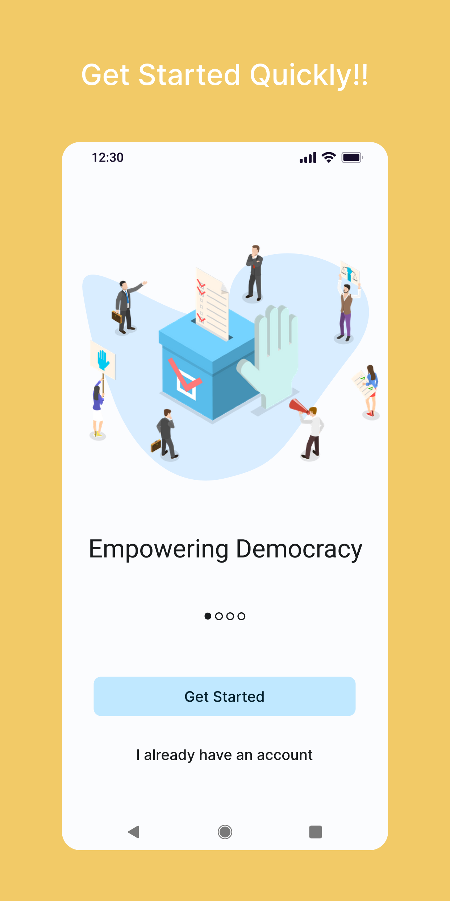
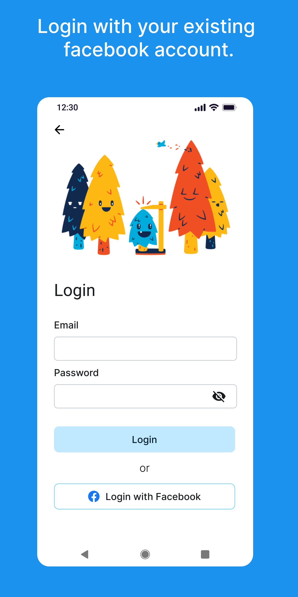
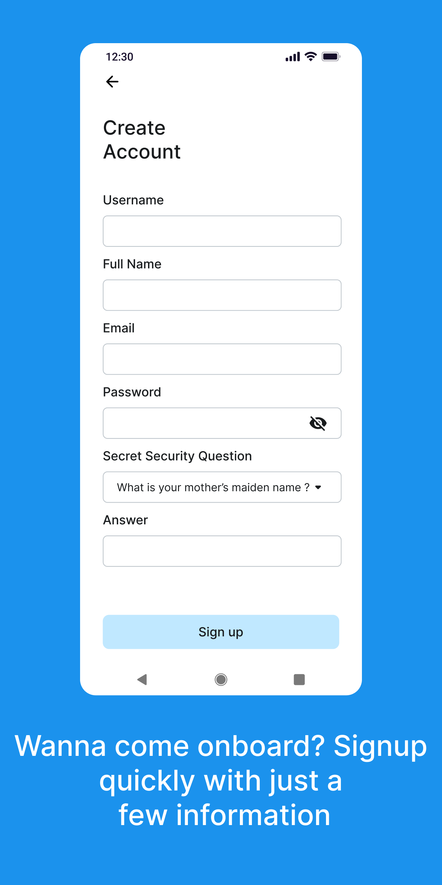
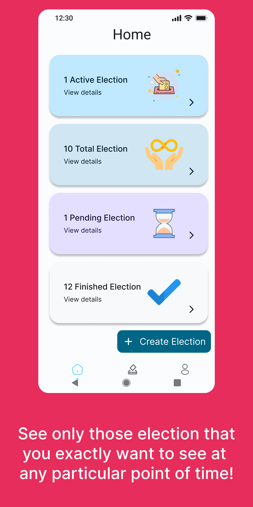
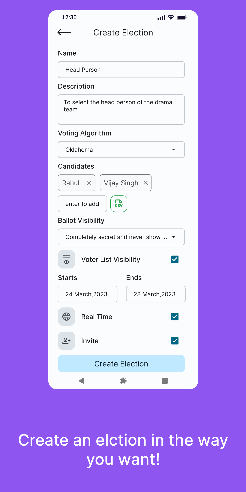
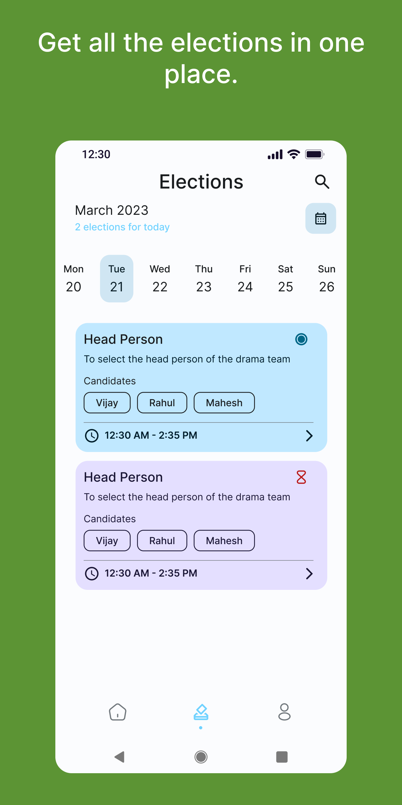
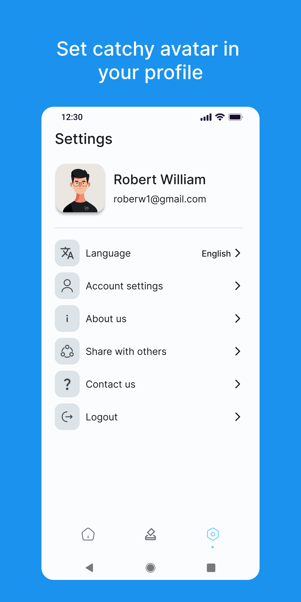
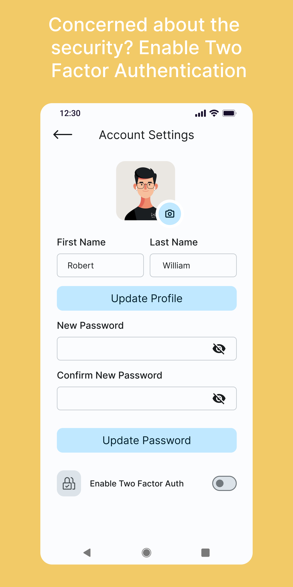
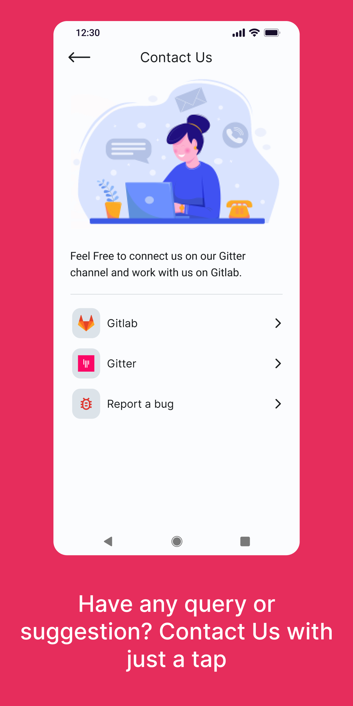
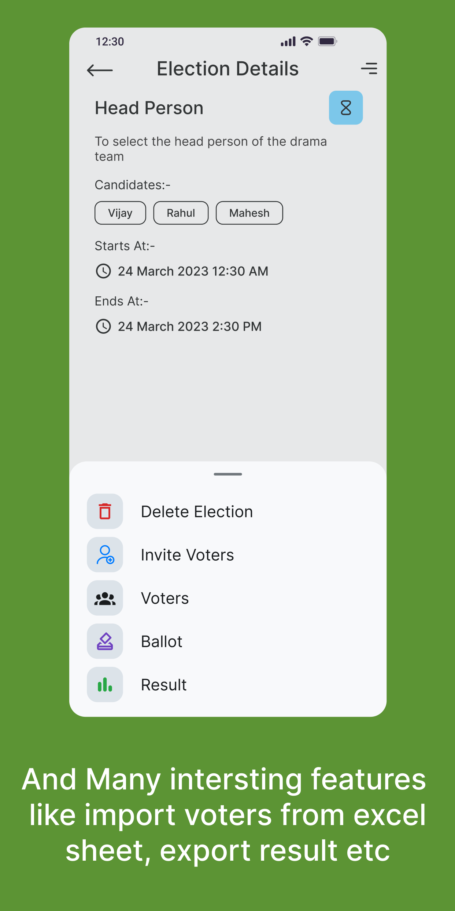

# Agora Android Application

_Android Application for Agora Web that uses [Agora](https://gitlab.com/aossie/Agora/): An Electronic Voting Library implemented in Scala. This application uses [Agora Web API](https://gitlab.com/aossie/Agora-Web) as backend application_

---
### Screenshots
<table>
  <tr>
    <td></td>
    <td></td>
    <td></td>
    <td></td>
    <td></td>
  </tr>
  <tr>
    <td></td>
    <td></td>
    <td></td>
    <td></td>
    <td></td>
  </tr>
</table>

---

## Contributing Guidelines
Please refer to [CONTRIBUTING.md](https://github.com/narendraanjana09/Agora-Android/CONTRIBUTING.md)

## Discussion
Join the discussion channels [Discord](https://discord.com/invite/6mFZ2S846n) [Gitter](https://gitter.im/AOSSIE/Agora-Android)

## Android specific guidelines
- Before committing code make sure that project [style](https://developer.android.com/studio/intro#style_and_formatting) is set to project.
- Use data-binding for any new code changes
- Write test cases ( both UI and unit as applicable for new features )
- Do-Not create any nested xml layouts, in case the view is complex to have more than two level nesting create a custom view
- Follow SOLID, clean code principles.
